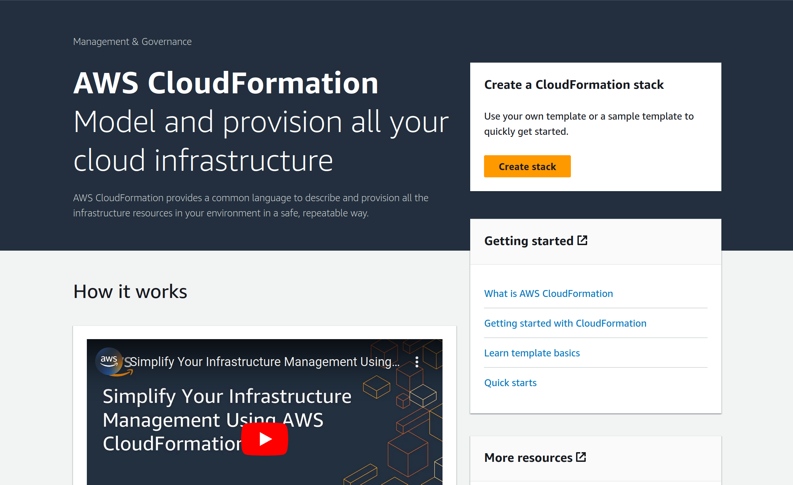
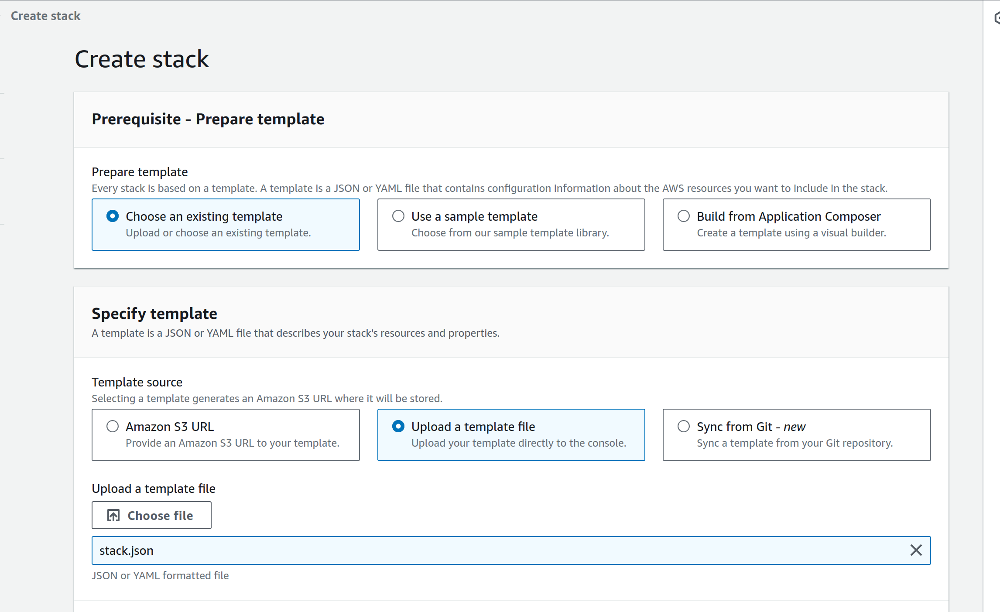
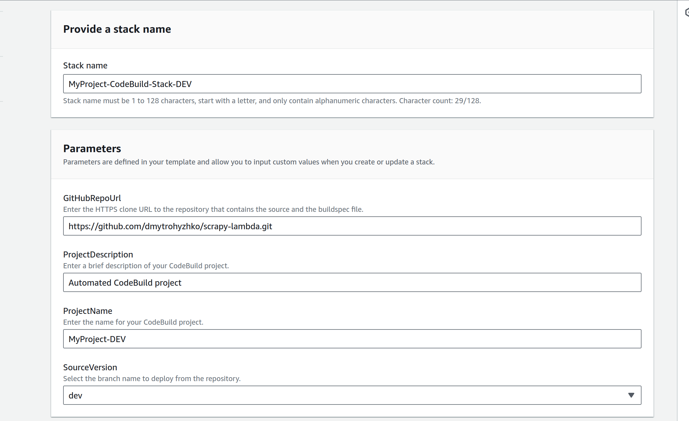
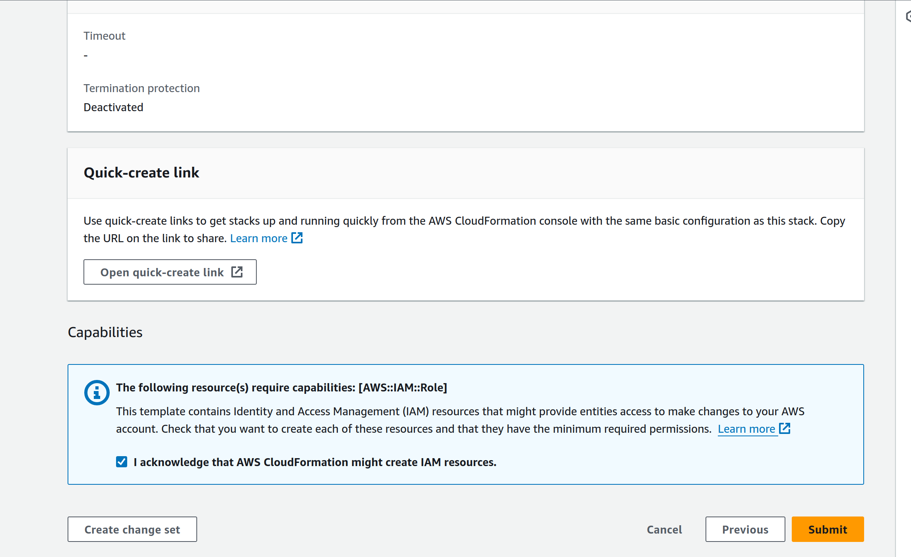

# AWS CodeBuild CF stack

## Important

You must connect your AWS account to your GitHub account. Use the AWS CodeBuild console to start creating a build project. When you use the console to connect (or reconnect) with GitHub, on the GitHub Authorize application page, for Organization access, choose Request access next to each repository you want to allow AWS CodeBuild to have access to, and then choose Authorize application.

> After you have connected to your GitHub account, you do not need to finish creating the build project. You can leave the AWS CodeBuild console.

## How to deploy this stack?

* In your AWS Account, navigate to CloudFormation and click on "**Create stack**"

* Step 1 - Create stack

Upload the `stack.json` template and click on "**Next**".

* Step 2 - Specify stack details

Enter your project details and choose the Git branch you want to use.

* Step 3 - Configure stack options

Click on "**Next**".

* Step 4 - Review and create

Check the box where it says "*I acknowledge that AWS CloudFormation might create IAM resources*." and click on "**Submit**".

> Upon initiation, a stack will be generated to establish a CodeBuild project. This project includes a webhook configured to seamlessly trigger AWS CodeBuild builds upon pushing to the specified branch.
